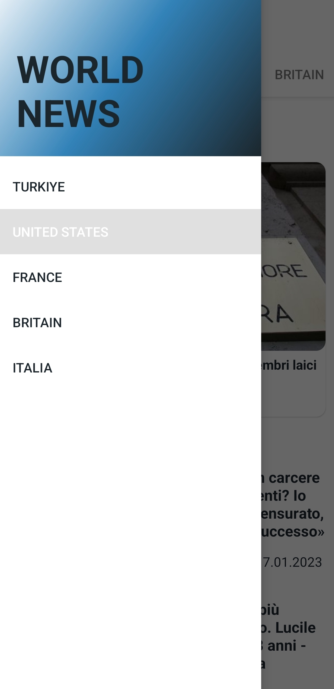
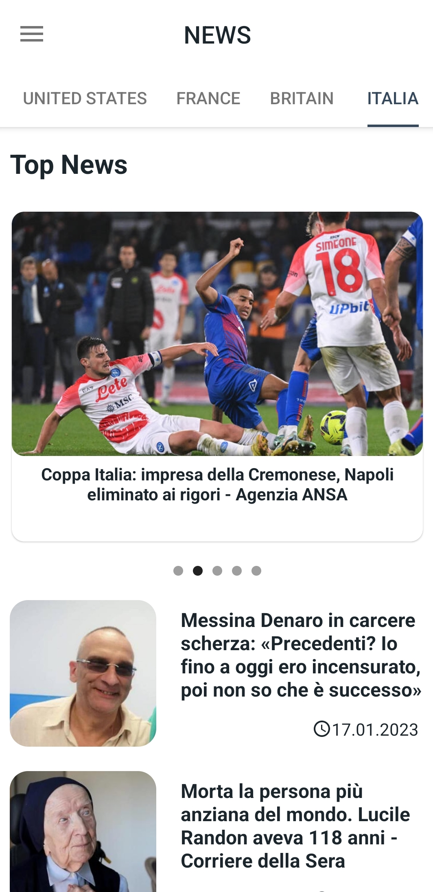

[![LinkedIn][linkedin-shield]][linkedin-url]
# Android - News Application

## About The Project

[![Product Name Screen Shot][product-screenshot]]()

This application gets news from `https://newsapi.org` API. 

Get more information about [@newsapi.org](https://newsapi.org)

* This project shows Türkiye, United States, France, Brazil and Italia news from `https://newsapi.org`

<p align="right">(<a href="#readme-top">back to top</a>)</p>

### Built With

Please to build the project use Android Studio.

* [![Android][Next.js]][Next-url]

<p align="right">(<a href="#readme-top">back to top</a>)</p>


<!-- GETTING STARTED -->
## Getting Started


### Installation

_Below is an example of how you can instruct your audience on installing and setting up your app. This template doesn't rely on any external dependencies or services._

1. Clone the repo with the git command below
   ```sh
   git clone https://github.com/umutaykol/Android-World_News.git
   ```
2. Open the project on Android Studio


<p align="right">(<a href="#readme-top">back to top</a>)</p>


<!-- USAGE EXAMPLES -->
## Usage

This application shows news from 5 countries. Easy to use just tab to the news which you want to see full detail of the article.


### Screenshots






<p align="right">(<a href="#readme-top">back to top</a>)</p>


<!-- CONTACT -->
## Contact

Umut Aykol - [@linkedin](https://www.linkedin.com/in/umut-aykol/) - mehmetumutaykol@gmail.com

Project Link: [https://github.com/umutaykol/Android-NewsApplication)

<p align="right">(<a href="#readme-top">back to top</a>)</p>


[linkedin-shield]: https://img.shields.io/badge/-LinkedIn-black.svg?style=for-the-badge&logo=linkedin&colorB=555
[linkedin-url]: https://www.linkedin.com/in/umut-aykol/

[product-screenshot]: images/news.png

[//]: # ([news_drawer]: images/news_drawer.jpg)

[//]: # ([news-screenshot]: images/news_drawer.jpg)

[Next.js]: https://img.shields.io/badge/Android%20Studio-3DDC84.svg?style=for-the-badge&logo=android-studio&logoColor=white
[Next-url]: https://developer.android.com/studio